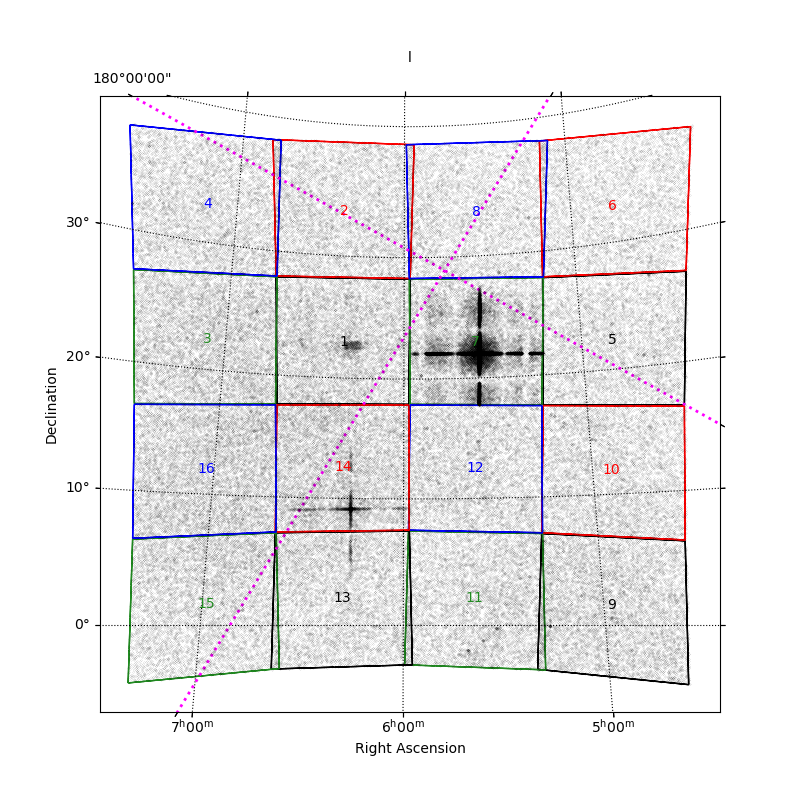
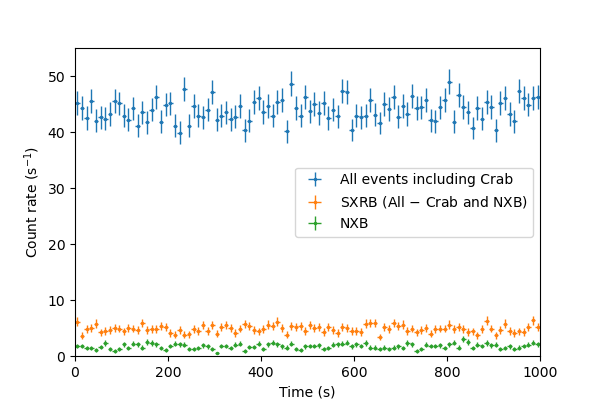
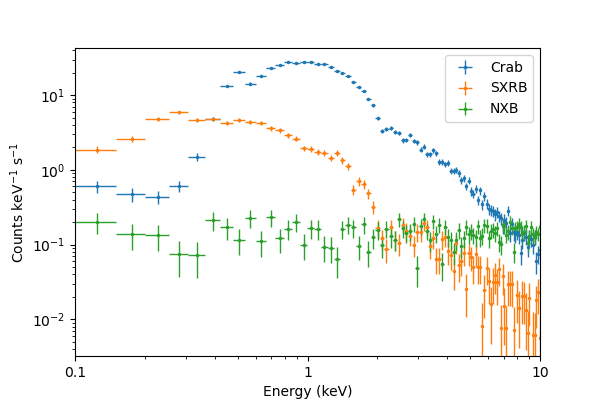

# Quick start

## Download software
- github respository<br>
https://github.com/sugizaki-mutsumi/myhzxsim

## Setup environment variables

1. Set python environmnet
```
$ conda activate
````

2. Set environment variables for HEASOFT and CALDB
```
### Heasoft (in a case of Ubuntu 24)
export HEADAS=${HOME}/headas/heasoft-6.36/x86_64-pc-linux-gnu-libc2.39
. $HEADAS/headas-init.sh

## CALDB
export CALDB=${HOME}/caldb
export CALDBCONFIG=$CALDB/software/tools/caldb.config
export CALDBALIAS=$CALDB/software/tools/alias_config.fits
```

3. Set HZXSIMDIR and PYTHONPATH
```
### HZXSIM
export HZXSIMDIR=${HOME}/myhzxsim
export PYTHONPATH=$HZXSIMDIR/pylib:$PYTHONPATH

```

## Test examples
1. Copy a sample script and parameter files to your work direct <br>

```
$ mkdir test_work
$ cd test_work
$ cp $HZXSIMDIR/test_sample/*.* ./
```

2. Run a simulation for Crab region with default configuration <br>
<!--
Several examples to run simulations including Crab observations are shown in the below.<br>
Each run creates processed event files.<br>
-->
```
$ ./myhzxsim.py
(Usage) myhzxsim.py (Obs parameter filename) [-s (X-ray source filename)] [-c (config filename)]

$ ./myhzxsim.py obsparam_crab.yml  
...
```
Event files are created in the directory OBSID (here, = 100000) 

3. plot mosaic image of all 4x4 units
```
$ python -i plt_mosaic.py
```



4. plot count rates of Crab, Soft X-ray BKG, Non X-ray BKG per unit #7
```
$ python -i plt_lc_crabreg.py 
```



5. plot spectra of Crab, Soft X-ray BKG, Non X-ray BKG per unit #7
```
$ python -i plt_spec_crabreg.py
```

