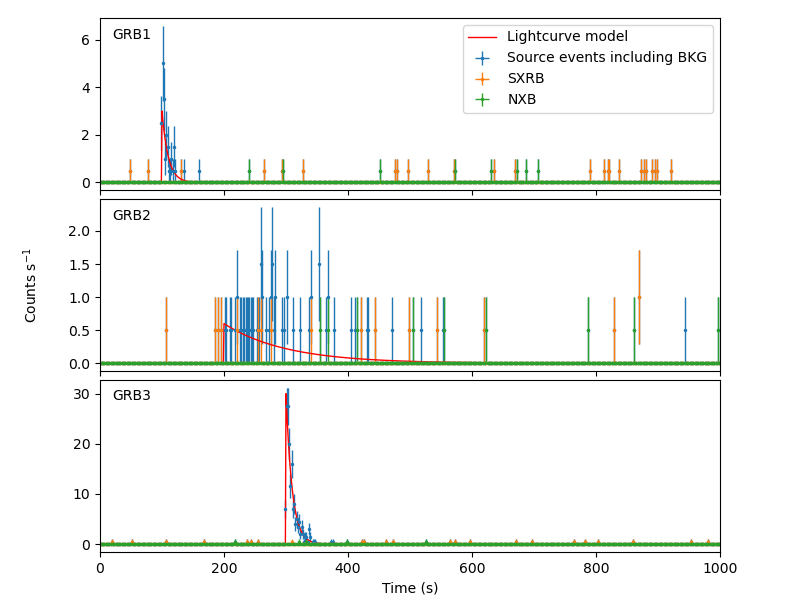
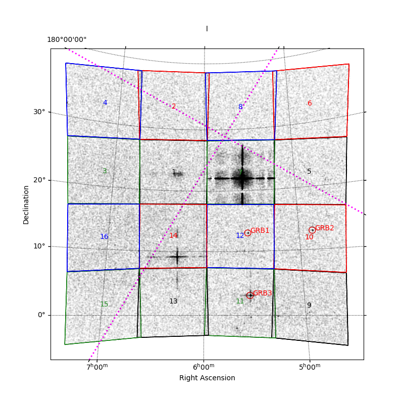
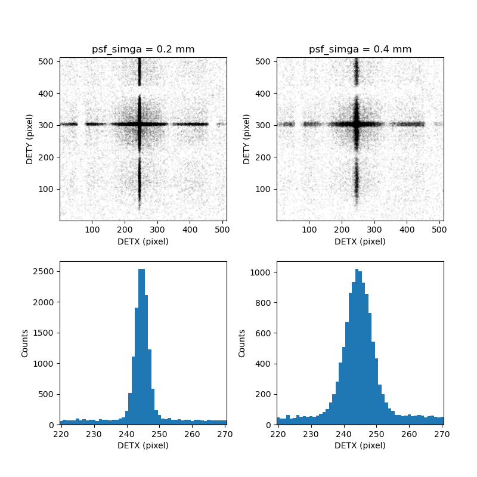

# Extended tutorials

## Simulate trasient sources
### 1. Create light-curve model file for GRB. 
```
$ python gen_lcfile.py
```
Three light-curve files, `grb1_lc.fits`, `grb2_lc.fits`, `grb3_lc.fits`, are created.


### 2. run simulator with a source parameter file including GRBs.
GRB source information in parameter file, `mytarget_grbs.yml`
```
- objectName: GRB1
  ra:  83.    ### RA in degree
  dec: 13.    ### Dec in degree 
  xsmodel: phabs*powerlaw.  ### Spectral model in XSPEC 
  xsparam: (0.3, 1.0, 1.0)  ### Spectral paremeters   
  lcfile: grb1_lc.fits.     ### Lightcurve file
...
```

run simulater with a source parameter file
```
### If the output directory already exists, rename it.
$ mv 100000 100000.1st

### run with option -s mytarget_grbs.yml
$ ./myhzxsim.py obsparam_crab.yml -s mytarget_grbs.yml
...
```
### 3. plot GRB lihgt curves and image
```
$ python -i plot_lc_grbs.py
```



```
$ python -i plot_mosaic.py
```


<br>

## Run with different configuration parameters
### 1. Customize configuration parameter file
modify psf_simga .0.2 (mm) to 0.4 (mm) 
```
### copy default configuration file
$ cp $HZXSIMDIR/refdata/myhzsim_default.yml myhzxsim_myconf.yml

### edit myhzxsim_myconf.yml
...
### PSF sigma in mm
#psf_sigma: 0.2  ### = 2.29 arcmin (sigma) = 5.38 arcmin (FWHM)
psf_sigma: 0.4  ### = 4.58 arcmin (sigma) = 10.8 arcmin (FWHM) 
...
```
### 2. Run simulator with the custom configuration file
```
## If the output directory already exists, rename it.
$ mv 100000 100000.2nd

### run with option  -c myhzxsim_myconf.yml
$ ./myhzxsim.py obsparam_crab.yml -c myhzxsim_myconf.yml
...
```

### 3. Plot PSF projection 
```
$ python -i plot_psfprof_crab.py
```

